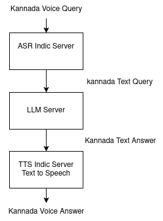

# Dhwani - Your Kannada Speaking Voice Buddy

## Overview

Dhwani is a self-hosted GenAI platform designed to provide voice mode interaction for Kannada and other Indian languages. 


## Workshop steps

### For Development 
- **Prerequisites**: Python 3.10
- **Steps**:
  1. **Create a virtual environment**:
  ```bash
  python -m venv venv
  ```
  2. **Activate the virtual environment**:
  ```bash
  source venv/bin/activate
  ```
  On Windows, use:
  ```bash
  venv\Scripts\activate
  ```
  3. **Install dependencies**:
  - ```bash
    pip install -r requirements.txt
    ```

### Chat / Answer
```bash
python src/chat-dhwani.py
```

### Translate
```bash
python src/translate-dhwani.py
```

### Speech to Text / ASR
```bash
python src/transcribe-dhwani.py
```


### Text to Speech
```bash
python src/text-to-speech-dhwani.py
```

## Video Tutorials


- Dhwani - How to use - Dhwani AI - Workshop:  20th March, 2025
[](https://youtu.be/f5JkJLQJFGA)


- Dhwani - How to use - API server
[](https://youtu.be/RLIhG1bt8gw)

- Dhwani - Intoduction to Project
[](https://youtu.be/kqZZZjbeNVk)


## Models and Tools

The project utilizes the following open-source tools:

| Open-Source Tool                       | Source Repository                                          | 
|---------------------------------------|-------------------------------------------------------------|
| Automatic Speech Recognition : ASR   | [ASR Indic Server](https://github.com/slabstech/asr-indic-server) | 
| Text to Speech : TTS                  | [TTS Indic Server](https://github.com/slabstech/tts-indic-server)  | 
| Translation                           | [Indic Translate Server](https://github.com/slabstech/indic-translate-server) | 
| Document Parser                       | [Indic Document Server](https://github.com/slabstech/docs-indic-server) |
| Dhwani Server | [Dhwani Server](https://github.com/slabstech/dhwani-server) | 
| Dhwani Android | [Android](https://github.com/slabstech/dhwani-android) |
| Large Language Model                  | [LLM Indic Server](https://github.com/slabstech/llm-indic-server_cpu) | 


## Architecture

| Answer Engine| Answer Engine with Translation                                 | Voice Translation                          |
|----------|-----------------------------------------------|---------------------------------------------|
|  |  |  |

